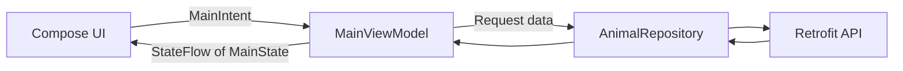

# MVI Architecture Sample

An Android sample application demonstrating Model–View–Intent (MVI) architecture with Jetpack Compose.

The app fetches animal data from a remote JSON endpoint, displays a loading shimmer, shows the results in a list, and opens a full-screen detail view when an animal is selected.

## Features

- Fetch animals from a remote API
- Animated shimmer while data is loading
- Animal list with a rounded thumbnail, name, and description
- Full-screen animal detail view
- Image-loading placeholders
- Retry UI when the request fails
- Unidirectional data flow using intents and state
- Dependency injection with Hilt

## Architecture

The application follows an MVI-style unidirectional data flow:



1. The UI sends a `MainIntent` to the ViewModel.
2. The ViewModel processes the intent.
3. Data operations are delegated to `AnimalRepository`.
4. The ViewModel produces a new `MainState`.
5. Compose observes the `StateFlow` and renders the new state.

### Intents

`MainIntent` represents actions received from the UI:

- `fetchAnimal` — fetch the animal list
- `SelectAnimal` — open an animal's details
- `BackToAnimalList` — return to the existing list

### States

`MainState` represents everything the UI can display:

- `Idle`
- `loading`
- `Animals`
- `AnimalDetail`
- `Error`

The animal list required for back navigation is carried by `MainState.AnimalDetail`. This keeps `MainState` as the single source of truth instead of storing a second copy inside the ViewModel.

## Tech Stack

- Kotlin
- Jetpack Compose
- ViewModel and StateFlow
- Kotlin Coroutines
- Retrofit and Gson
- Hilt
- Glide
- Material 3
- JUnit

## Project Structure

```text
app/src/main/java/com/example/mviarchitecture
├── MainActivity.kt
├── MviApplication.kt
├── data
│   ├── api
│   │   └── AnimalApiService.kt
│   ├── model
│   │   └── Animal.kt
│   └── repository
│       └── AnimalRepository.kt
├── di
│   └── NetworkModule.kt
├── intent
│   ├── MainIntent.kt
│   └── MainState.kt
├── ui
│   └── theme
└── viewmodel
    └── MainViewModel.kt
```

## API

The sample uses the following JSON endpoint:

[Animal.Json](https://gist.githubusercontent.com/Aliendroid8045/b09f9ac24273b6fd8e5184bdf1d3a62e/raw/c0fbbe02a3973477f3e18fdf16cb9b1a7f979f6a/Animal.Json)

Each animal contains:

```kotlin
data class Animal(
    val name: String,
    val thumbnail: String,
    val image: String,
    val description: String
)
```

## Getting Started

### Requirements

- Android Studio
- JDK 17
- Android SDK 35
- Minimum Android SDK 28

### Run the app

1. Clone or download the project.
2. Open it in Android Studio.
3. Allow Gradle synchronization to complete.
4. Run the `app` configuration on an emulator or Android device.

You can also build the debug APK from the terminal:

```bash
./gradlew :app:assembleDebug
```

## MVI Example

The UI sends an intent:

```kotlin
viewModel.onIntent(MainIntent.SelectAnimal(animal))
```

The ViewModel updates state:

```kotlin
is MainIntent.SelectAnimal -> {
    val currentState = state.value

    if (currentState is MainState.Animals) {
        _state.value = MainState.AnimalDetail(
            animal = intent.animal,
            animals = currentState.animal
        )
    }
}
```

The UI renders the state:

```kotlin
when (state) {
    MainState.Idle,
    MainState.loading -> AnimalShimmer()

    is MainState.Animals -> AnimalList(state.animal)
    is MainState.AnimalDetail -> AnimalDetailScreen(state.animal)
    is MainState.Error -> ErrorContent(state.error)
}
```

## Why MVI?

MVI provides:

- Predictable state transitions
- A single direction for data flow
- Clear separation between UI actions and UI state
- Easier debugging and testing
- Fewer conflicting sources of truth

MVI introduces additional state and intent classes, so it is most useful for screens with asynchronous work, multiple user actions, and several UI states.

