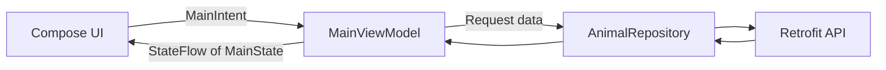
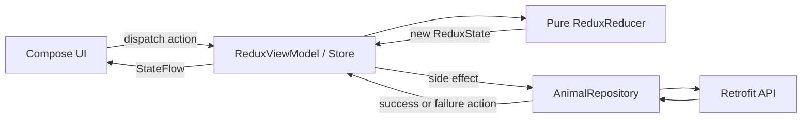

# MVI and Redux Architecture Sample

An Android sample application demonstrating two approaches to unidirectional data flow with Jetpack Compose:

1. MVI
2. MVI with a Redux-style reducer

The launcher screen lets users select either implementation. Both screens fetch the same animal data and provide the same UI, making it easier to compare their architecture rather than their features.

## Features

- Fetch animals from a remote API
- Animated shimmer while data is loading
- Animal list with a rounded thumbnail, name, and description
- Full-screen animal detail view
- Image-loading placeholders
- Retry UI when the request fails
- Architecture selector with MVI and MVI-Redux options
- Unidirectional data flow using intents/actions and state
- Pure reducer in the Redux implementation
- Dependency injection with Hilt

## Running the Sample

When the application starts, the main screen displays:

- **MVI** — opens the standard MVI implementation
- **MVI-Redux** — opens the Redux-style implementation

Both screens support loading, successful data, errors, animal selection, full-screen details, and back navigation.

## MVI Architecture

The MVI implementation uses `MainIntent`, `MainState`, and `MainViewModel`.



1. The UI sends a `MainIntent` to the ViewModel.
2. The ViewModel processes the intent.
3. Data operations are delegated to `AnimalRepository`.
4. The ViewModel produces a new `MainState`.
5. Compose observes the `StateFlow` and renders the new state.

### MVI Intents

`MainIntent` represents actions received from the UI:

- `fetchAnimal` — fetch the animal list
- `SelectAnimal` — open an animal's details
- `BackToAnimalList` — return to the existing list

### MVI States

`MainState` represents everything the UI can display:

- `Idle`
- `loading`
- `Animals`
- `AnimalDetail`
- `Error`

The animal list required for back navigation is carried by `MainState.AnimalDetail`. This keeps `MainState` as the single source of truth instead of storing a second copy inside the ViewModel.

## MVI-Redux Architecture

The Redux implementation introduces a stricter rule:

> Every state change must pass through the reducer.



### Redux Actions

`ReduxAction` represents user actions and operation results:

- `FetchAnimals`
- `AnimalsLoaded`
- `FetchFailed`
- `SelectAnimal`
- `BackToAnimalList`

The distinction between request and result actions is important. `FetchAnimals` starts the operation, while `AnimalsLoaded` and `FetchFailed` describe its result.

### Redux State

Redux uses one immutable state object:

```kotlin
data class ReduxState(
    val animals: List<Animal> = emptyList(),
    val selectedAnimal: Animal? = null,
    val isLoading: Boolean = false,
    val error: String? = null
)
```

This state is the only source of truth for the Redux screen.

### Pure Reducer

The reducer receives the current state and an action, then returns a new state:

```kotlin
fun reduce(
    state: ReduxState,
    action: ReduxAction
): ReduxState
```

The reducer:

- Does not call Retrofit or the repository
- Does not launch coroutines
- Does not modify the existing state
- Always returns a new state using `copy()`
- Produces the same output for the same state and action

Network requests are side effects handled by `ReduxViewModel`. Their results are dispatched back as `AnimalsLoaded` or `FetchFailed` actions.

## MVI vs MVI-Redux

| MVI | MVI-Redux |
|---|---|
| UI sends an intent | UI dispatches an action |
| ViewModel may update state directly | State changes only through the reducer |
| Fewer classes and less boilerplate | More explicit state transitions |
| Good for most feature screens | Useful for complex or highly stateful features |
| Easy to learn and implement | Reducer is easy to test independently |
| Request and result may be handled together | Requests and results are separate actions |

Both approaches use one-way data flow. Redux-style MVI adds stricter state-transition rules, but it also introduces additional actions and reducer code.

## Tech Stack

- Kotlin
- Jetpack Compose
- ViewModel and StateFlow
- Kotlin Coroutines
- Retrofit and Gson
- Hilt
- Glide
- Material 3
- JUnit

## Project Structure

```text
app/src/main/java/com/example/mviarchitecture
├── MainActivity.kt
├── MviApplication.kt
├── data
│   ├── api
│   │   └── AnimalApiService.kt
│   ├── model
│   │   └── Animal.kt
│   └── repository
│       └── AnimalRepository.kt
├── di
│   └── NetworkModule.kt
├── mvi
│   ├── MviAnimalActivity.kt
│   ├── intent
│   │   ├── MainIntent.kt
│   │   └── MainState.kt
│   └── viewmodel
│       └── MainViewModel.kt
├── redux
│   ├── ReduxAction.kt
│   ├── ReduxActivity.kt
│   ├── ReduxReducer.kt
│   ├── ReduxState.kt
│   └── ReduxViewModel.kt
├── ui
│   └── theme
```

## API

The sample uses the following JSON endpoint:

[Animal.Json](https://gist.githubusercontent.com/Aliendroid8045/b09f9ac24273b6fd8e5184bdf1d3a62e/raw/c0fbbe02a3973477f3e18fdf16cb9b1a7f979f6a/Animal.Json)

Each animal contains:

```kotlin
data class Animal(
    val name: String,
    val thumbnail: String,
    val image: String,
    val description: String
)
```

## Getting Started

### Requirements

- Android Studio
- JDK 17
- Android SDK 35
- Minimum Android SDK 28

### Run the app

1. Clone or download the project.
2. Open it in Android Studio.
3. Allow Gradle synchronization to complete.
4. Run the `app` configuration on an emulator or Android device.

You can also build the debug APK from the terminal:

```bash
./gradlew :app:assembleDebug
```

## MVI Example

The UI sends an intent:

```kotlin
viewModel.onIntent(MainIntent.SelectAnimal(animal))
```

The ViewModel updates state:

```kotlin
is MainIntent.SelectAnimal -> {
    val currentState = state.value

    if (currentState is MainState.Animals) {
        _state.value = MainState.AnimalDetail(
            animal = intent.animal,
            animals = currentState.animal
        )
    }
}
```

The UI renders the state:

```kotlin
when (state) {
    MainState.Idle,
    MainState.loading -> AnimalShimmer()

    is MainState.Animals -> AnimalList(state.animal)
    is MainState.AnimalDetail -> AnimalDetailScreen(state.animal)
    is MainState.Error -> ErrorContent(state.error)
}
```

## Why MVI?

MVI provides:

- Predictable state transitions
- A single direction for data flow
- Clear separation between UI actions and UI state
- Easier debugging and testing
- Fewer conflicting sources of truth

MVI introduces additional state and intent classes, so it is most useful for screens with asynchronous work, multiple user actions, and several UI states.

## Redux Example

The Redux UI dispatches an action:

```kotlin
viewModel.dispatch(ReduxAction.SelectAnimal(animal))
```

The ViewModel passes it to the reducer:

```kotlin
_state.value = ReduxReducer.reduce(_state.value, action)
```

The reducer creates the next state:

```kotlin
is ReduxAction.SelectAnimal -> state.copy(
    selectedAnimal = action.animal
)
```

## Which Architecture Should You Choose?

Choose regular MVI when:

- The screen has manageable state transitions
- You want clear one-way data flow with less boilerplate
- Direct ViewModel state updates remain easy to understand

Choose Redux-style MVI when:

- The feature has many state transitions
- Several operations can affect the same state
- You want every transition centralized in a pure reducer
- Reducer-level testing and action logging are valuable

For many Android applications, regular MVI with one immutable UI state is sufficient. Redux becomes more valuable as state interactions become harder to reason about.
